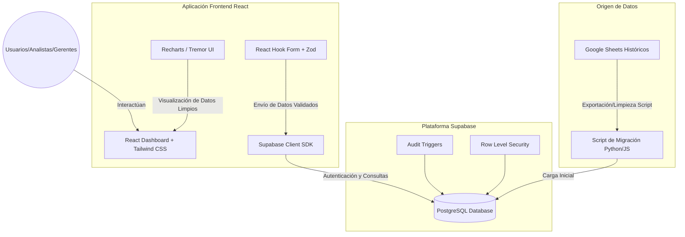

# Proyecto de Centralización de Datos: Supabase + React

Este documento detalla la propuesta de arquitectura, diseño de base de datos, estrategia de gobernanza de datos y el plan de implementación para migrar la información desde Google Sheets dispersos a una única base de datos relacional segura en Supabase, con una interfaz visual premium en React para analistas, operadores y gerentes.

---

## 1. Diagnóstico del Problema y Metas del Proyecto

### Problema Actual:
* **Datos inconsistentes (Bad Data):** Usuarios ingresan formatos incorrectos, registros duplicados, valores nulos donde no deberían o referencias inexistentes.
* **Falta de control de versiones e historial:** No hay trazabilidad de quién modificó qué celda ni cuándo.
* **Limitación en el análisis:** Los analistas gastan más del 60% de su tiempo limpiando datos antes de poder entrenar modelos o generar gráficos para la gerencia.
* **Seguridad y Accesibilidad:** Cualquiera con acceso al Google Sheet puede borrar o alterar datos históricos críticos.

### Metas del Proyecto:
1. **Verdad Única (Single Source of Truth):** Base de datos relacional centralizada (Postgres en Supabase).
2. **Validación en Múltiples Capas:** Impedir que entren datos erróneos mediante validación en el cliente (React) y restricciones estrictas en la base de datos (Postgres `CHECK` constraints, `FOREIGN KEY`s y tipos de datos estrictos).
3. **Pistas de Auditoría (Audit Logs):** Tabla de auditoría automática que registre cada inserción, actualización y eliminación de registros.
4. **Visualización y Reportes Premium:** Panel de control en React interactivo, rápido y estéticamente superior para que la gerencia tome decisiones informadas basadas en datos limpios.

---

## 2. Propuesta de Arquitectura y Tecnologías



### Stack Tecnológico Propuesto:
* **Base de Datos:** PostgreSQL (alojado en **Supabase**). Aprovecharemos:
  * **RLS (Row Level Security):** Para restringir quién puede insertar/editar datos según su rol.
  * **Triggers y Funciones PL/pgSQL:** Para registrar cambios en tablas de auditoría automáticamente.
* **Frontend:** **React** (utilizando **Vite** para desarrollo rápido y optimizado).
* **Estilos y Componentes:** **Tailwind CSS** + **Shadcn/UI** (para una interfaz moderna, limpia, con soporte para modo oscuro/claro y animaciones sutiles).
* **Librería de Gráficos:** **Recharts** o **Tremor** para dashboards interactivos de alta calidad.
* **Validación de Formularios:** **React Hook Form** junto con **Zod** para definir esquemas estrictos en el cliente.

---

## 3. Estructura de la Base de Datos (Supabase / Postgres)

Para garantizar la calidad de los datos, diseñaremos esquemas relacionales estrictos. Supongamos un ejemplo de inventario de tecnologías (basado en el nombre del repositorio `inventario-tecnologias`), pero esto se adaptará a tu caso de uso específico.

### Tabla: `usuarios_roles`
Define los roles del sistema (Admin, Editor, Analista).
```sql
CREATE TYPE user_role AS ENUM ('admin', 'editor', 'analista');

CREATE TABLE usuarios_roles (
    id UUID REFERENCES auth.users(id) ON DELETE CASCADE PRIMARY KEY,
    email VARCHAR(255) NOT NULL,
    rol user_role NOT NULL DEFAULT 'analista',
    created_at TIMESTAMP WITH TIME ZONE DEFAULT TIMEZONE('utc'::text, NOW()) NOT NULL
);
```

### Tabla: `tecnologias` (Ejemplo de catálogo con validación)
```sql
CREATE TABLE tecnologias (
    id BIGINT GENERATED BY DEFAULT AS IDENTITY PRIMARY KEY,
    nombre VARCHAR(100) NOT NULL UNIQUE,
    categoria VARCHAR(50) NOT NULL,
    version_actual VARCHAR(30) DEFAULT '1.0.0',
    estado VARCHAR(20) NOT NULL CONSTRAINT chk_estado CHECK (estado IN ('activo', 'obsoleto', 'en evaluacion')),
    costo_mensual NUMERIC(12, 2) NOT NULL CONSTRAINT chk_costo CHECK (costo_mensual >= 0),
    fecha_adquisicion DATE NOT NULL,
    responsable_email VARCHAR(255) NOT NULL,
    created_at TIMESTAMP WITH TIME ZONE DEFAULT TIMEZONE('utc'::text, NOW()) NOT NULL,
    updated_at TIMESTAMP WITH TIME ZONE DEFAULT TIMEZONE('utc'::text, NOW()) NOT NULL
);
```

### Tabla: `audit_logs` (Trazabilidad Absoluta)
Registra cualquier cambio de datos automáticamente mediante un disparador (Trigger) en Postgres.
```sql
CREATE TABLE audit_logs (
    id BIGINT GENERATED BY DEFAULT AS IDENTITY PRIMARY KEY,
    tabla_afectada VARCHAR(100) NOT NULL,
    operacion VARCHAR(10) NOT NULL, -- 'INSERT', 'UPDATE', 'DELETE'
    id_registro VARCHAR(100) NOT NULL,
    valores_anteriores JSONB,
    valores_nuevos JSONB,
    usuario_id UUID REFERENCES auth.users(id),
    usuario_email VARCHAR(255),
    fecha TIMESTAMP WITH TIME ZONE DEFAULT TIMEZONE('utc'::text, NOW()) NOT NULL
);
```

---

## 4. Estrategia de Calidad de Datos (Anti-Bad Data)

Implementaremos 3 niveles de defensa contra datos inválidos o corruptos:

| Nivel | Componente | Mecanismo | Propósito |
| :--- | :--- | :--- | :--- |
| **Nivel 1: UI** | React Forms + Zod | Validación de entradas en tiempo real (por ejemplo: que el costo sea positivo, emails válidos, fechas no futuras). | Prevenir errores del usuario antes de enviar la petición (UX rápida). |
| **Nivel 2: API** | Supabase RLS & Policies | Validación de sesión y rol del usuario. | Impedir escrituras no autorizadas o modificaciones directas malintencionadas. |
| **Nivel 3: DB** | Postgres Constraints | Restricciones `CHECK`, claves foráneas, campos obligatorios (`NOT NULL`) y tipos de datos correctos. | Garantizar la integridad de los datos a nivel físico. Aunque la UI falle o se haga un bypass, la BD rechazará datos incorrectos. |

---

## 5. Plan de Migración de Google Sheets a Supabase

Para pasar la información actual ordenada y limpia:

1. **Auditoría de Hojas Actuales:** Analizar la estructura de las hojas de cálculo existentes, identificar inconsistencias, nombres duplicados o valores nulos.
2. **Diseño del Script de Limpieza (ETL):** Crearemos un script en Node.js o Python que lea los archivos CSV/Google Sheets, aplique reglas de limpieza (por ejemplo, estandarizar texto a minúsculas, formatear fechas a `YYYY-MM-DD`, castear números) y los reporte si fallan.
3. **Carga de Datos de Prueba (Staging):** Subir una muestra limpia a Supabase para validar las relaciones e integridad de datos.
4. **Carga en Producción:** Ejecutar la migración masiva y activar las políticas de seguridad RLS inmediatamente después.

---

## 6. Diseño del Frontend en React (Dashboard de Analítica)

La aplicación visual estará dividida en:
* **Vista de Control de Calidad y Carga (Data Management):** Formularios avanzados con autocompletado y validaciones visuales claras donde los editores pueden ingresar o modificar registros uno a uno o en lote (con previsualización antes de guardar).
* **Vista de Auditoría (Audit Logs Explorer):** Un historial visible para administradores y analistas de qué datos cambiaron, quién los cambió y cuándo, facilitando la detección de anomalías.
* **Dashboard Ejecutivo (Management Dashboard):** Gráficos dinámicos e indicadores clave (KPIs) usando `Recharts` o `Tremor` que consultan directamente las tablas limpias de Supabase.

---

## Preguntas Abiertas para el Usuario

> [!IMPORTANT]
> Para ajustar esta documentación y las siguientes etapas, por favor comparte tus comentarios sobre las siguientes preguntas:
>
> 1. **¿Qué tipo de datos contienen tus Google Sheets actuales?** (Ej. inventarios de tecnología, licencias, hardware, asignaciones de personal, costos). Esto nos ayudará a diseñar las tablas reales de Postgres.
> 2. **¿Cuántos usuarios aproximadamente editarán los datos y cuántos serán solo lectores (como los gerentes)?**
> 3. **¿Cuentas ya con un proyecto de Supabase creado, o te gustaría que lo configuremos desde cero?**

---

## Plan de Verificación

Una vez aprobado el plan, realizaremos las siguientes pruebas para certificar la calidad:
1. **Pruebas de Inserción Incorrecta:** Intentaremos ingresar datos con formatos erróneos (costos negativos, fechas inválidas) para verificar que la base de datos y la UI rechacen el guardado.
2. **Pruebas de Roles (RLS):** Validar que un usuario lector (Analista/Gerente) no pueda alterar registros mediante la API de Supabase.
3. **Verificación de Auditoría:** Modificar un registro de prueba y corroborar que se genere la entrada correspondiente en `audit_logs` con el antes y después.
