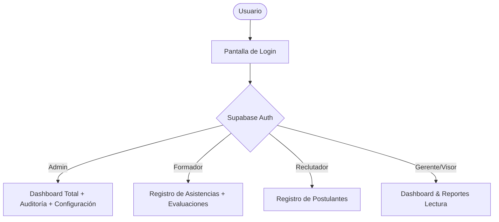

# Hoja de Ruta (Roadmap): Escalado a Producción - GEA DataCenter

Como arquitecto y desarrollador experto en Supabase + React, he preparado esta propuesta detallada para llevar el sistema desde su prototipo actual (Fase 1) a una plataforma empresarial robusta, escalable y segura (Fase 2).

---

## 📌 Diagnóstico del Estado Actual vs. Producción

El prototipo actual es excelente para visualización y validación local, pero presenta limitaciones importantes para un entorno multiusuario real:

| Característica | Estado Actual (Prototipo) | Requerimiento para Producción |
| :--- | :--- | :--- |
| **Seguridad de Acceso** | Claves anónimas abiertas en RLS (`anon` y `authenticated` con acceso total). Sin login. | Autenticación real (Supabase Auth) y Control de Acceso Basado en Roles (RBAC). |
| **Paginación y Carga** | Descarga del 100% de registros en memoria. Filtro y paginación en el cliente. | Paginación, búsqueda y filtros delegados a la base de datos (Server-side). |
| **Importación de Datos** | Script de NodeJS local que requiere abrir la consola y escribir comandos. | Carga masiva directa en la UI mediante arrastrar y soltar archivos Excel (`.xlsx`). |
| **Evaluaciones** | Tabla creada en base de datos, pero sin interfaz de registro ni edición. | Formulario y listado de evaluaciones con cálculo automático de aprobados. |
| **Reportes y Reportabilidad** | Visualización en gráficos de dashboard, pero sin salida de datos. | Exportación en un clic de tablas filtradas a archivos Excel listos para la gerencia. |

---

## 🛠️ Plan de Implementación de Nuevas Características

### 1. Autenticación de Usuarios y Roles (RBAC)

Para que el sistema sea seguro, debemos saber qué usuario realiza cada acción y limitar sus permisos:



#### Acciones en Base de Datos:
1. **Crear tabla de perfiles (`profiles`):**
   Vinculada a la tabla de usuarios internos de Supabase (`auth.users`) para almacenar el rol y nombre completo del usuario.
   ```sql
   CREATE TYPE app_role AS ENUM ('admin', 'reclutador', 'formador', 'visor');

   CREATE TABLE perfiles (
       id UUID REFERENCES auth.users(id) ON DELETE CASCADE PRIMARY KEY,
       nombre VARCHAR(200) NOT NULL,
       rol app_role NOT NULL DEFAULT 'visor',
       created_at TIMESTAMP WITH TIME ZONE DEFAULT TIMEZONE('utc'::text, NOW()) NOT NULL
   );
   ```
2. **Restringir Políticas RLS:**
   Modificar las políticas de `rls_fix.sql` para que evalúen el rol real del usuario desde su token JWT en Supabase.
   ```sql
   CREATE POLICY insert_postulantes ON postulantes 
   FOR INSERT TO authenticated 
   WITH CHECK (
       EXISTS (
           SELECT 1 FROM perfiles 
           WHERE perfiles.id = auth.uid() AND perfiles.rol IN ('admin', 'reclutador')
       )
   );
   ```

#### Acciones en Frontend:
* **Pantalla de Inicio de Sesión:** Un formulario elegante en React que solicite correo y contraseña.
* **Componente de Rutas Protegidas:** Ocultar pestañas laterales en el menú según el rol asignado (por ejemplo, los reclutadores no deben ver la sección de auditoría ni asistencia).

---

### 2. Carga Masiva desde Excel (Bulk Import)

En lugar de registrar los postulantes uno a uno en el formulario de nómina, los analistas de reclutamiento podrán cargar listas completas arrastrando el Excel semanal.

#### Cómo lo implementaremos:
1. **Instalación de librería:** Usaremos la librería `xlsx` (SheetJS) en el frontend.
2. **Componente de Carga (`ExcelImporter.jsx`):**
   * Zona de arrastre de archivos (*drag-and-drop*) con animaciones en Tailwind.
   * Procesador del archivo en cliente para transformarlo en objetos JSON.
3. **Mapeador y Validador en Cliente (Anti-Bad Data):**
   El frontend validará los datos de cada fila del Excel *antes* de enviarlos a la base de datos:
   * Formato de correo electrónico válido.
   * DNI con número de caracteres adecuado.
   * Si hay algún error, se mostrará en una tabla interactiva con alertas color rojo, indicando la fila y la celda exacta que el usuario debe corregir.
4. **Inserción Eficiente (Upsert Batch):**
   Uso del método `.insert(rows, { onConflict: 'documento' })` de Supabase para subir los registros limpios en un solo viaje al servidor.

---

### 3. Paginación y Filtros en el Servidor (Server-side)

Actualmente la base de datos tiene 583 registros, pero en pocos meses crecerá a decenas de miles. Para mantener el sistema ultrarrápido:

#### Cómo lo implementaremos:
1. **Modificar el servicio `dataService.js`:**
   Recibirá argumentos de consulta:
   ```javascript
   export async function fetchPostulantesPaged({ page = 1, pageSize = 50, search = '', sede = '', reclutador = '' }) {
     let query = supabase
       .from('postulantes')
       .select('*', { count: 'exact' });

     // Filtros en servidor
     if (search) {
       query = query.or(`documento.ilike.%${search}%, nombres.ilike.%${search}%, apellido_paterno.ilike.%${search}%`);
     }
     if (sede && sede !== 'TODAS') {
       query = query.eq('sede_id', sede);
     }
     
     // Rango de paginación
     const from = (page - 1) * pageSize;
     const to = from + pageSize - 1;
     query = query.range(from, to).order('created_at', { ascending: false });

     const { data, count, error } = await query;
     return { data, totalCount: count };
   }
   ```
2. **Búsqueda con Debounce:**
   Agregar un retraso de 300ms al escribir en el buscador para no inundar el servidor de consultas por cada letra ingresada.

---

### 4. Módulo de Evaluaciones de Capacitación

La tabla `evaluaciones_capacitacion` en Postgres almacena tres notas (Alfabetidad, Orientación al Cliente, Habilidades de Contacto) y un estado final (Aprobado/Desaprobado).

#### Cómo lo implementaremos:
1. **Nueva pestaña en frontend: "Evaluaciones"**
2. **Formulario de Calificación:**
   * Al seleccionar un grupo de capacitación, se listará a los postulantes activos del grupo.
   * El formador podrá escribir las notas de 0 a 10.
   * El sistema calculará el promedio y sugerirá automáticamente el resultado (Aprobado si promedio >= 7, por ejemplo).
   * Botón para guardar las notas de todo el grupo de forma masiva.

---

### 5. Exportación de Datos en 1 Clic (Excel/CSV)

Los analistas deben entregar reportes diarios a la gerencia.
* Agregaremos un botón **"Exportar a Excel"** en la tabla de postulantes y en la de asistencias.
* Utilizaremos `xlsx` para estructurar la hoja de cálculo limpia, aplicando filtros activos (por ejemplo: exportar solo los postulantes de la sede "COMAS" de la campaña "CONTACTADOS").

---

### 6. Alertas de Deserción y Bajas Automáticas

El sistema de asistencias puede automatizar la detección de candidatos que ya no asisten.
* Si un postulante registra **2 Faltas Injustificadas consecutivas (FI)**, el sistema enviará una alerta en rojo al formador sugiriendo dar de **Baja (B)** al postulante.
* Esto evitará que se arrastren registros fantasma en las nóminas semanales.

---

## 📅 Propuesta de Fases de Desarrollo

Para no abrumarte, podemos implementar esto de forma modular:

1. **Sprint 1 (Filtros en servidor + Módulo de Evaluaciones):** Optimizar la carga de datos del dashboard y tablas, y habilitar el registro de notas.
2. **Sprint 2 (Excel Drag & Drop + Exportación):** Habilitar la importación masiva directa desde el navegador para dejar de usar la terminal.
3. **Sprint 3 (Autenticación + Roles de Usuario):** Proteger el acceso de datos y restringir acciones por usuario.

---

> [!NOTE]
> **¿Qué opinas de esta hoja de ruta?** Dime cuál de estas características es la más prioritaria para ti y comenzaremos con su diseño e implementación paso a paso.
